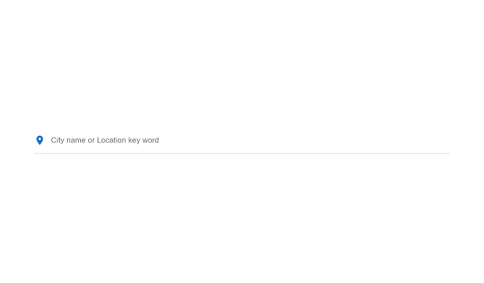
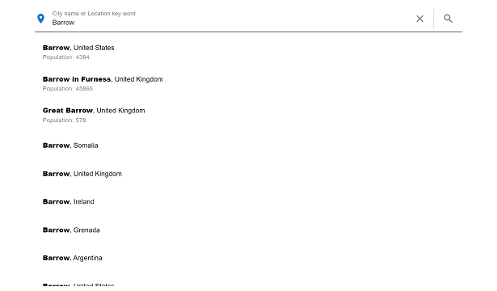
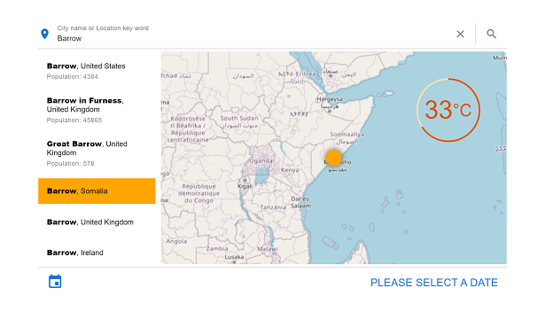
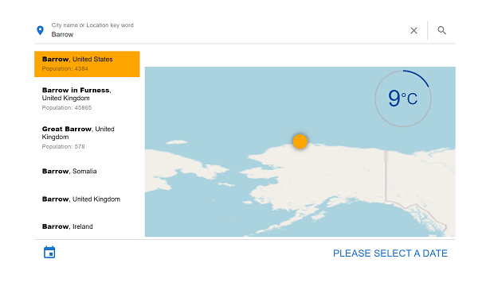
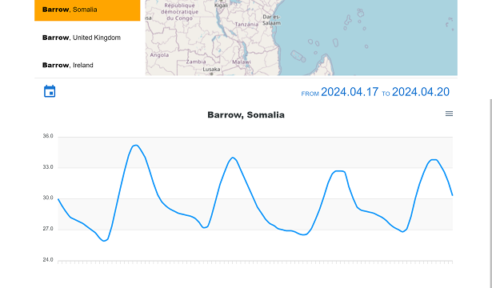
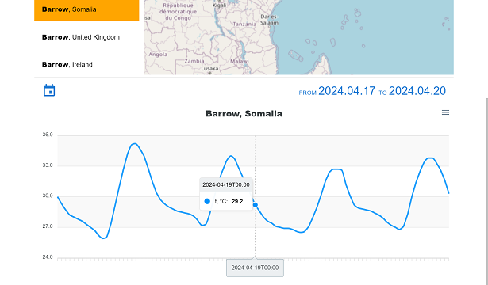

# WeatherApp

### The application to check the air temperature of any location on the Earth.
It displays the list of appropriate location, current temperature for chosen location and hourly temperature of selected range of dates.

The application utilize the data from [open-meteo.com](https://open-meteo.com)

To get started first of all please type desired location name. If there are some appropriate results, chose the most suitable one. Otherwise, try to specify your request.

When you select a specific location, it will be shown on the map and the current temperature will be displayed on the map as well.
There are no plus or minus signs; instead, it is highlighted in color - orange for positive temperatures and minus for negative temperatures. The temperature value is measured in degrees Celsius.

For more detailed information please select a required diapason of dates:

